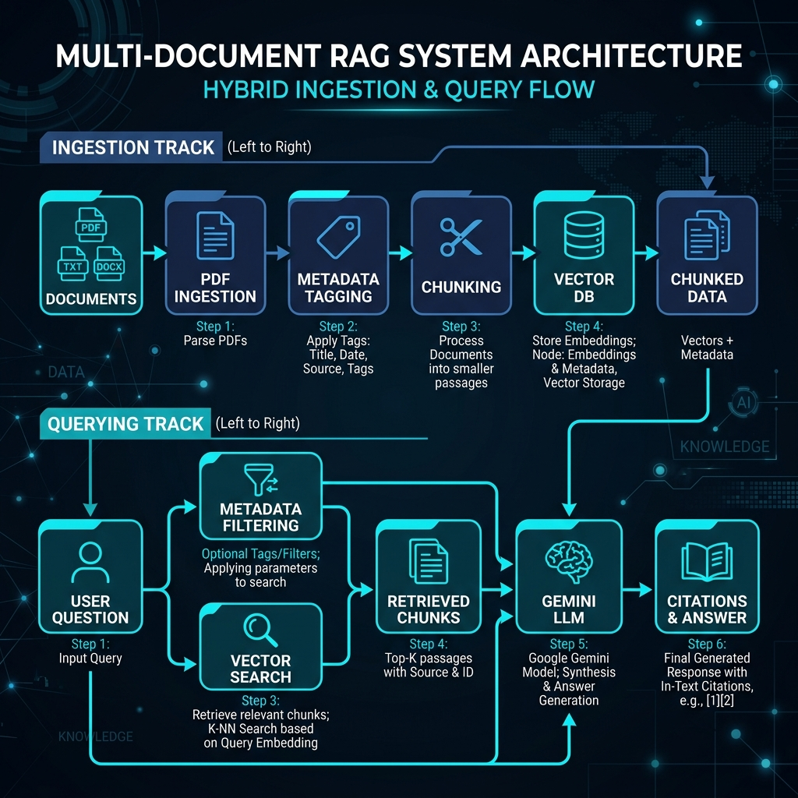

# Veritas AI - Multi-Document Relational RAG

This project is a full-stack document analysis and query synthesis platform using Next.js (App Router, Tailwind CSS v3) for the frontend dashboard and Express.js (Node.js) for the backend, integrated with LangChain, Pinecone vector storage, and Gemini models.

---

## System Architecture & Flowchart

Below is the design flowchart for the **Multi-Document Relational RAG** setup. This architecture is built to support uploading multiple textbooks and question papers, metadata-tagging them, and selectively tracing questions back to textbook chapters or generating grounded answers.



---

## Project Structure

```
Basic-Rag/
├── backend/ (Root Level Backend)
│   ├── server.js             # Express API Server (Port 5001)
│   ├── indexing_phase.js     # LangChain PDF Ingestion & Pinecone Indexing
│   ├── query_phase.js        # RAG query retrieval and Gemini completion logic
│   └── package.json          # Node dependencies (LangChain, Pinecone, Express)
│
└── frontend/                 # Next.js Application (Port 3000)
    ├── src/app/
    │   ├── page.js           # Multi-Pane Interactive Dashboard
    │   ├── globals.css       # Custom Glassmorphic Styles & Fonts
    │   └── layout.js         # Core Layout Metadata
    └── tailwind.config.js    # Tailwind CSS v3 Config
```

---

## Core Process Details

### 1. Ingestion Pipeline
* **PDF Upload & Metadata**: Custom documents (textbooks, query logs, exam sheets) are ingested. Metadata tags (`document_type`, `source_name`, `page_number`) are assigned to keep track of their origin.
* **Semantic Splitter**: Breaks documents into paragraphs (1000 characters chunk size, 200 overlap).
* **Pinecone Vector DB**: Store vectorized embeddings with metadata.

### 2. Multi-Mode Querying
* **Relational Search**: Submit a question paper text, query Pinecone filtered strictly by `document_type == "textbook"`, and ask Gemini to pinpoint the exact chapter, lesson, or page number.
* **Grounded Answer**: Answer a question based on a specific textbook, refusing to answer if the context cannot be found in the target source.

---

## Setup & Running Guide

### Step 1: Run the Backend
Ensure your `.env` contains your `GEMINI_API_KEY`, `PINECONE_API_KEY`, and `PINECONE_INDEX_NAME`.
In the root directory, run:
```bash
npm install
npm run server
# Starts backend server at http://localhost:5001
```

### Step 2: Run the Frontend
In the `frontend` folder, run:
```bash
cd frontend
npm install
npm run dev
# Starts dev web app at http://localhost:3000
```
